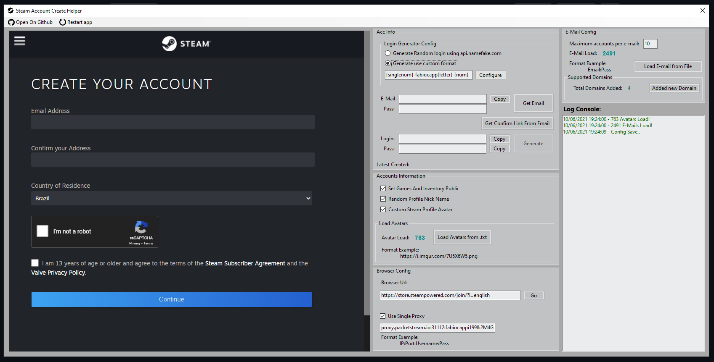

# SteamAccountCreateHelper

---

---

## Description

Simple application that checks an email and obtains the automatic email code, also generates a login and password for the account, the only thing you need to do manually is resolve the CAPTCHA

New Interface V1.2.2
 
---
Old Interface V1.1
 
---

## DISCLAIMER
This project is provided on AS-IS basis, without any guarantee at all. Author is not responsible for any harm, direct or indirect, that may be caused by using this project. You use this project at your own risk.
